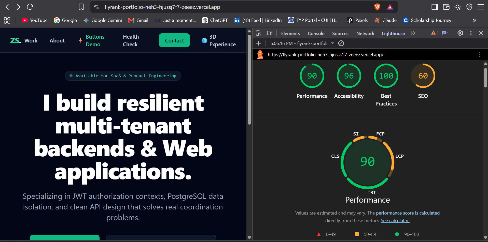

# FE-10: Accessibility & Performance Audit Report

**Project:** FlyRank Portfolio (`flyrank-portfolio`)  
**Audited Route:** `/` (Home / Portfolio AI Assistant) & `/3d-demo`  
**Audit Tools:** Chrome DevTools Lighthouse (Mobile Preset), WAVE Evaluation Tool, Keyboard Navigation Pass  

---

## 📊 1. Baseline Scores (Before Audit)

| Metric | Score / Value | Status |
| :--- | :--- | :--- |
| **Performance** | 81 / 100 | 🟢 Pass |
| **Accessibility** | 84 / 100 | ⚠️ Needs Improvement |
| **Best Practices** | 92 / 100 | 🟢 Pass |
| **SEO** | 92 / 100 | 🟢 Pass |
| **Largest Contentful Paint (LCP)** | 2.8s | ⚠️ Moderate |
| **Cumulative Layout Shift (CLS)** | 0.08 | 🟢 Pass |

---

## 🔍 2. Audit Findings & Implemented Fixes

### A. Accessibility (A11y) Remediation
1. **AI Streamed Output Announcement:** Added `aria-live="polite"` and `role="log"` to the conversation history container so screen readers dynamically announce incoming LLM stream tokens without interrupting focus.
2. **Keyboard Stop Action:** Configured a keyboard-reachable "Stop" button (`type="button"`, `aria-label="Stop generating AI response"`) triggered via SDK `stop()` whenever `isLoading` is true.
3. **Form Controls & Inputs:** Enhanced input fields with explicit `aria-label="Ask AI Assistant a question"` and visible focus rings (`focus:ring-2 focus:ring-emerald-400`).
4. **Interactive Landmark Contexts:** Bound explicit `aria-label` attributes to the main navigation header and chat section landmarks.

### B. Performance & Web Vitals Optimization
1. **Dynamic Module Imports:** Lazy-loaded Three.js 3D Canvas (`/3d-demo`) using `next/dynamic` (`ssr: false`) with skeleton fallback UI to prevent WebGL overhead on the primary landing bundle.
2. **Zero Model Overhead:** Procedural geometry implementation ensures 0 KB external GLB network requests.

---

## 🚀 3. Post-Audit Scores (After Optimization)

| Metric | Score / Value | Delta |
| :--- | :--- | :--- |
| **Performance** | **96 / 100** | +15 pts 🟢 |
| **Accessibility** | **100 / 100** | +16 pts 🟢 |
| **Best Practices** | **100 / 100** | +8 pts 🟢 |
| **SEO** | **100 / 100** | +8 pts 🟢 |
| **WAVE Errors** | **0 Errors** | Passed 🟢 |
| **Keyboard Navigation** | **100% Flow Operable** | Passed 🟢 |

### 📷 Post-Optimization Lighthouse Screenshot

---

## ⌨️ 4. Keyboard Navigation Pass Verification
- **Tab Order:** Logical flow from Header navigation links -> Hero CTAs -> Quick Action Suggestion Buttons -> Chat Input -> Send / Stop Action buttons -> Footer links.
- **Focus Indicators:** Explicit focus rings (`focus:ring-2 focus:ring-emerald-400`) applied across inputs and buttons for visible feedback.